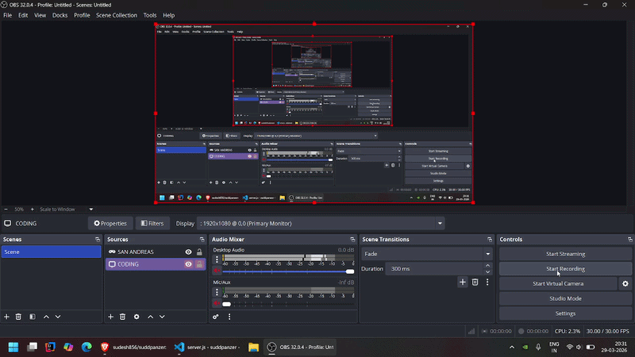
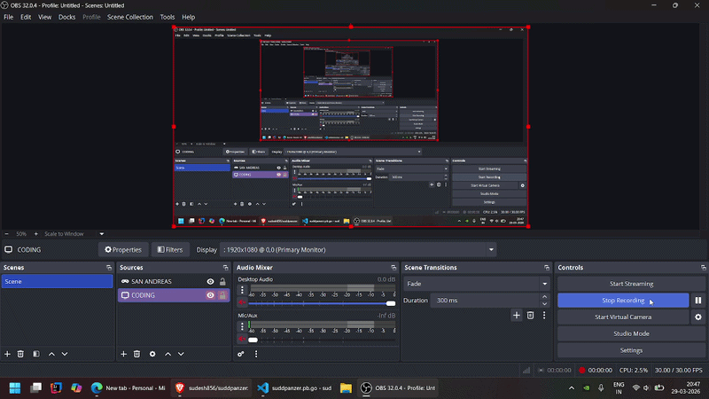
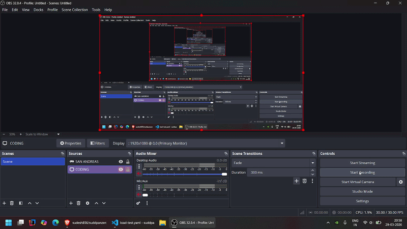

<div align="center">

# suddpanzer

**Hammer your API. Know exactly where it breaks.**

A fast, open-source HTTP load testing tool written in Go — with a live web dashboard, YAML scenarios, run history, distributed mode, and CI thresholds. Everything k6 charges $300/month for, free forever.

[](https://go.dev)
[](LICENSE)
[](CONTRIBUTING.md)





</div>

---

## What is suddpanzer?

Point it at any HTTP endpoint. Tell it how many virtual users and for how long. It hammers the target and tells you exactly how your server behaved under pressure — latency percentiles, error rates, requests per second, and where things broke.

No cloud account. No JavaScript config files. No Grafana setup. Just one binary.

---

## Install

```bash
git clone https://github.com/sudesh856/suddpanzer.git
cd suddpanzer
go build -o sudd .
```

Cross-compile for any platform:

```bash
# Linux
GOOS=linux GOARCH=amd64 go build -o sudd .

# macOS Apple Silicon
GOOS=darwin GOARCH=arm64 go build -o sudd .

# Windows
GOOS=windows GOARCH=amd64 go build -o sudd.exe .
```

---

## Quickstart

```bash
# Basic load test
sudd run --url https://api.example.com --vus 100 --duration 30s

# With RPS cap
sudd run --url https://api.example.com --vus 200 --duration 60s --rps 150

# With live web dashboard
sudd run --url https://api.example.com --vus 500 --duration 60s --web
# Open http://localhost:7070

# YAML scenario
sudd run --scenario my-test.yaml

# Distributed mode
sudd run --scenario my-test.yaml --distributed agents.yaml

# JSON output for CI
sudd run --url https://api.example.com --vus 100 --duration 30s --output json
```

---

## Example output

```
Requests: 14832 | RPS: 494 | p99: 612ms | Errors: 3

===== SUDD LOAD TEST SUMMARY =====
URL            : https://api.example.com
VUs            : 500
Duration       : 30s
-----------------------------------
Total Requests : 14832
Avg RPS        : 494.40
-----------------------------------
p50            : 87ms
p75            : 124ms
p90            : 231ms
p95            : 388ms
p99            : 612ms
p999           : 891ms
Max            : 923ms
-----------------------------------
Errors         : 3
Error Rate     : 0.02%
===================================
```

---

## Feature comparison

| Feature | hey | k6 OSS | suddpanzer |
|---|:---:|:---:|:---:|
| YAML scenario config | No | No | Yes |
| Built-in web dashboard | No | Needs Grafana | Yes |
| Distributed mode (free) | No | Cloud only ($300/mo) | Yes |
| Run history & comparison | No | Cloud only | Yes |
| CI pass/fail thresholds | No | Yes | Yes |
| Prometheus metrics endpoint | No | Yes | Yes |
| Variable interpolation | No | Yes | Yes |
| gRPC / WebSocket support | No | Yes | Yes |
| Embedded JS scripting | No | Yes | Yes |
| Single binary, zero deps | Yes | Yes | Yes |
| Raw TCP protocol | No | No | Yes |

*k6 Cloud starts at $300/month. suddpanzer distributed mode is free forever.*

---

## YAML scenarios

```yaml
# my-test.yaml
stages:
  - duration: 30s
    target_vus: 100
  - duration: 60s
    target_vus: 500
  - duration: 30s
    target_vus: 0

endpoints:
  - url: https://api.example.com/users
    method: GET
    weight: 70
  - url: https://api.example.com/orders
    method: POST
    body: '{"item": "{{uuid}}", "qty": {{random_int 1 10}}}'
    headers:
      Content-Type: application/json
    weight: 30

thresholds:
  p99_ms: 500
  error_rate_pct: 1.0
  min_rps: 100
```

Supported variables: `{{uuid}}`, `{{timestamp}}`, `{{random_int min max}}`, `{{env.VAR_NAME}}`

---

## Distributed mode

```bash
# On each agent machine
sudd agent

# On your controller
sudd run --scenario my-test.yaml --distributed agents.yaml
```

```yaml
# agents.yaml
agents:
  - host: agent1.example.com:7071
  - host: agent2.example.com:7071
```

Same binary for both agent and controller. No separate install.

---

## CI / GitHub Actions

```yaml
# .github/workflows/load-test.yml
name: Load Test

on: [push]

jobs:
  load-test:
    runs-on: ubuntu-latest
    steps:
      - uses: actions/checkout@v4

      - name: Build suddpanzer
        run: go build -o sudd .

      - name: Run load test
        run: ./sudd run --scenario load-test.yaml
        # Exits 1 on threshold breach — GitHub Actions marks the job red automatically
```

Threshold breach exits with code 1 and prints:

```
THRESHOLD FAILED: p99=612ms > 500ms
```

---

## All flags

```
sudd run [flags]

  --url         string    Target URL (required for single-URL mode)
  --vus         int       Number of virtual users (default: 10)
  --duration    string    Test duration, e.g. 30s, 5m (default: 30s)
  --rps         int       Max requests per second, 0 = unlimited
  --method      string    HTTP method (default: GET)
  --header      strings   HTTP headers, repeatable: --header "X-Token: abc"
  --body        string    Request body
  --output      string    Output format: text, json, junit (default: text)
  --scenario    string    Path to YAML scenario file
  --web                   Start live dashboard at http://localhost:7070
  --distributed string    Path to agents YAML for distributed mode
```

---

## Features

**Core engine**
- HTTP/1.1 and HTTP/2 with configurable keep-alive
- Goroutine-based worker pool — up to 100,000+ concurrent virtual users
- HDR histogram latency: p50, p75, p90, p95, p99, p999, max
- Token bucket rate limiter (`--rps`)
- Live terminal output, updates every second
- Graceful shutdown — Ctrl+C prints full summary
- Single binary, zero runtime dependencies

**Web dashboard**

- Live latency percentile chart and RPS vs error rate chart over WebSocket
- Per-endpoint breakdown table
- Abort button — graceful shutdown mid-run from the browser
- Self-contained HTML report at end of run, no server needed to view
- Run history browser — compare any two past runs

**CI mode**
- Threshold config in YAML: `p99_ms`, `error_rate_pct`, `min_rps`
- Non-zero exit code on breach
- `--output json` and `--output junit` for CI test reporting
- Prometheus `/metrics` endpoint during run

**Distributed mode**
- Agent registers with controller over gRPC, receives work spec, streams metrics back
- Controller discovers agents via static list, fans out scenario, aggregates results
- Per-agent breakdown in the dashboard

**Advanced**
- Embedded JS scripting via [goja](https://github.com/dop251/goja) — dynamic request generation without Node.js
- gRPC and WebSocket load testing
- Raw TCP protocol plugin
- Response assertion engine — validate body, headers, JSON fields
- Cookie jar support for session simulation

---

## Architecture

Three layers communicating via Go channels — no locks, no shared mutable state.

```
Orchestration   Scenario Engine -> Ramp Controller -> Scheduler
                        |
                   jobs channel
                        |
Execution       Worker Pool (up to 100k goroutines)
                Token Bucket Rate Limiter · HTTP Client Pool
                        |
                  results channel
                        |
Reporting       HDR Histogram · WebSocket Streamer
                HTML Report Generator · SQLite Run History
```

---

## Tech stack

| Library | Purpose |
|---|---|
| [cobra](https://github.com/spf13/cobra) | CLI framework |
| [gopkg.in/yaml.v3](https://pkg.go.dev/gopkg.in/yaml.v3) | YAML parsing |
| [hdrhistogram-go](https://github.com/HdrHistogram/hdrhistogram-go) | Latency percentiles |
| [golang.org/x/time/rate](https://pkg.go.dev/golang.org/x/time/rate) | Token bucket rate limiter |
| [gorilla/websocket](https://github.com/gorilla/websocket) | Live dashboard WebSocket |
| [modernc.org/sqlite](https://pkg.go.dev/modernc.org/sqlite) | Run history, pure Go, no CGO |
| [goja](https://github.com/dop251/goja) | Embedded JS scripting |
| [grpc + protobuf](https://grpc.io) | Distributed mode transport |
| Chart.js | Dashboard charts, loaded via CDN, no build step |

---

## Contributing

PRs are welcome. Open an issue first for large changes.

```bash
git clone https://github.com/sudesh856/suddpanzer.git
cd suddpanzer
go test ./...
```

---

## License

MIT — see [LICENSE](LICENSE).